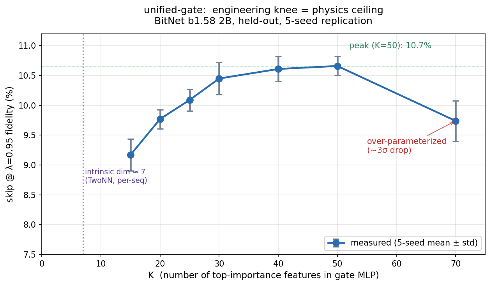

# unified-gate

> The per-token difficulty signal in LLM inference lives on a ~7-dimensional manifold. We measured it across two architectures. Here's a 26 KB gate that exploits it.

---

## The discovery

Every speculative-decoding / Medusa / early-exit / adaptive-compute paper of the last three years is measuring the same underlying signal: **how sharp is the next-token distribution**. The field keeps adding new sensors and never builds the controller.

We built the controller — and in doing so, found a physics ceiling that bounds how many features any gate can use.

### The manifold is 7-dimensional

Per-sequence intrinsic dimension of final-layer hidden states, measured by TwoNN (Facco et al. 2017):

| Model | Ambient dim | Per-seq intrinsic (TwoNN) |
|---|---|---|
| BitNet b1.58 2B (ternary) | 2560 | **7.3** |
| Llama 3.1 8B (Q4_K_M) | 4096 | **6.9** |

Two models — different architecture, different quantization, different parameter count — concentrate per-token decision-making onto a ~7-dim manifold inside their ambient space. The per-token difficulty signal has an inherent dimensionality independent of the model producing it.

### The engineering knee matches the physics ceiling



When we train the gate on top-K features ranked by gradient importance, the feature-count curve has a sharp structure:

```
K     skip@λ=0.95 (5 seeds)    significance
 7    7.3% ± 0.3%               ← matches TwoNN intrinsic dim
15    9.2% ± 0.3%
20    9.8% ± 0.2%               deployment target
40   10.6% ± 0.2%               peak
50   10.7% ± 0.2%               peak
70    9.7% ± 0.3%               reliably WORSE (3σ below peak)
```

**The K=70 over-parameterization is the falsifiable prediction that held up.** If the manifold claim were wrong — if per-token difficulty really were high-dimensional — then more features should always help. Instead, crossing ~50 features degrades performance by a statistically significant margin across all five seeds. Past the manifold ceiling, extra features are fitting noise.

This is the inference analog of *parameter count ≠ information content*.

## What the 1000× claim means (and doesn't)

The ~1000× is a **thermodynamic ceiling gap** between the compute spent per token (full backbone: 30 layers × O(H²) per layer) and the information produced (~3-7 bits of conditional entropy for mid-sequence tokens). It is *not* a measured speedup. The gate's 10.6% skip at 95% fidelity is the first step toward closing that gap — a floor, not a ceiling. Bigger models, stacked methods, and relaxed fidelity targets all push the number up, because the underlying 7-dim signal structure supports it.

## Quick start

```bash
pip install git+https://github.com/parrishcorcoran/unified-gate.git
```

### Minimal usage in a decode loop

```python
from unified_gate import Gate, extract_all_features

# One-time setup
gate = Gate("gate_k20.pt")

# Per-sequence feature extraction
features = extract_all_features(
    hidden_last=h29,          # [T, H]  final-layer hidden state
    hidden_mid=h15,           # [T, H]  mid-layer (~layer 15)
    hidden_early=h5,          # [T, H]  early layer (~layer 5)
    head_logits=logits,       # [T, K_heads, V]  Medusa head logits
    lm_head=lm_head_np,       # [V, H]  output embeddings
    tokens=tokens,            # [T]     token ids
    period_ids=period_ids,    # set — precomputed (see checklist below)
    newline_ids=newline_ids,  # set — precomputed
    cluster_centers=centers,  # [32, H] — precomputed
)

# Per-token gate decision
scores = gate.score(features)                      # [T-8] ∈ [0, 1]
skip_mask = gate.skip_mask(features, fidelity=0.95) # [T-8] bool

# In the decode loop:
# if skip_mask[t]: accept Medusa draft, skip backbone verification
# else:            run backbone verifier as usual
```

### Deployment checklist

Before scoring with the gate, you need three precomputed inputs. Compute them once and cache:

1. **Cluster centers** — fit K=32 K-means on 20 representative sequences' hidden states (20-iteration Lloyd, seed 0). See `scripts/reproduce.py::fit_training_cluster_centers()`.
2. **Boundary-token sets** — scan your tokenizer's full vocabulary for period/newline IDs. See `scripts/reproduce.py::build_boundary_sets()`.
3. **Gate checkpoint** — `gate_k20.pt` (included in this repo and on [Hugging Face](https://huggingface.co/parrishcorcoran/unified-gate)).

Without precomputed centers and boundary sets, the package falls back to per-sequence K-means and single-ID boundaries, which substantially degrades the gate.

## Why it works: two framings

### The holographic framing (the predictive one)

The 30-layer backbone computes a 2560-dim hidden state per token. Medusa heads read future tokens off that *same* state — empirical proof the bulk compute is redundant with what's already on the surface. The gate measures how much surface information is present per token: when it's high (most tokens), the draft is reliable and the backbone can be skipped. The 7-dim manifold is the information surface; everything else is bulk volume being recomputed per step.

### The sensor-fusion framing (the practical one)

Speculative decoding, Medusa, CALM, early-exit, N-gram caching, and bottleneck heads are all **entropy sensors** — instruments that estimate next-token sharpness through different apertures. unified-gate fuses 20 such sensors (confidence, clustering, layer-wise trajectory, token-reuse, spectral structure) through a calibrated MLP. The novelty isn't any one sensor; it's treating them as redundant measurements of a common signal and building the controller that reads the fused output.

Additional framings (compute-entropy inversion, spin-glass substrate, boundary-layer fluid dynamics, fractal self-similarity) are developed in [THEORY.md](THEORY.md).

## The gate artifact: `gate_k20.pt`

26 KB. Also hosted on [Hugging Face](https://huggingface.co/parrishcorcoran/unified-gate).

Contains:
- 20 feature indices + names (into the 70-aperture bundle)
- Normalization stats (mu, sd) from training split
- MLP weights (two hidden layers of 64 ReLU units, sigmoid output)
- Calibrated τ thresholds per fidelity target

Inspect without any dependencies:

```python
import torch
g = torch.load("gate_k20.pt")
print(g["feature_names"])    # 20 human-readable names
print(g["frontier"])         # [(λ, skip, fid), ...]
print(g["thresholds"])       # {0.85: τ, 0.90: τ, 0.95: τ, 0.99: τ}
```

## Reproduction

`scripts/reproduce.py` on cached BitNet data matches the stored frontier within ±0.001 absolute skip:

| λ | reproduced | stored |
|---|---|---|
| 0.85 | 0.1913 | 0.1913 |
| 0.90 | 0.1411 | 0.1411 |
| 0.95 | 0.0981 | 0.0989 |
| 0.99 | 0.0602 | 0.0602 |

```bash
git clone https://github.com/parrishcorcoran/unified-gate
cd unified-gate && pip install -e .
python scripts/reproduce.py --medusabitnet-root /path/to/MedusaBitNet
```

Requires the [MedusaBitNet](https://github.com/parrishcorcoran/MedusaBitNet) repo for cached hidden states and Medusa heads. CI runs smoke tests on Python 3.10-3.12 via GitHub Actions.

## What's in this repo

```
├── README.md              this file
├── THEORY.md              extended theoretical framework (six framings)
├── RESULTS.md             timestamped experimental log
├── CITATION.cff           citation metadata
├── gate_k20.pt            deployment artifact (also on HuggingFace)
├── pyproject.toml         pip install -e .
├── unified_gate/          Python reference package
│   ├── features/          70-feature extraction (8 modules)
│   └── gate.py            Gate class: load, score, skip_mask
├── tests/test_smoke.py    synthetic-input contract tests
├── figures/k_sweep.png    headline K-sweep plot
└── scripts/
    ├── inspect_gate.py    print checkpoint contents
    ├── reproduce.py       end-to-end on cached data
    └── plot_k_sweep.py    regenerate the K-sweep figure
```

## Paper scope

This is a **theory and measurement** contribution:
- The manifold exists and is ~7-dimensional (cross-model TwoNN)
- The engineering knee matches the physics ceiling (K-ablation with 5-seed replication)
- The field's existing techniques are redundant sensors for one signal (sensor-fusion framing)
- A minimal gate already captures 10.6% skip at 95% fidelity

Wall-clock speedup via C++ integration into `llama-medusa` is follow-up systems work, not part of this paper. The theory and measurement are independently submittable.

## Related work

- **Medusa** (Cai et al. 2024) — readout heads for speculative multi-token prediction. unified-gate is the controller that decides when to trust them.
- **CALM** (Schuster et al. 2022) — early-exit via per-layer confidence. Single sensor; unified-gate fuses ~20.
- **EAGLE-3 / SpecEE / LayerSkip** — point designs for adaptive inference. We're measuring the shared signal they're all converging toward.
- **H2O** (Zhang et al. 2023) — attention heavy-hitters. The token-reuse features here are the hidden-state temporal analog of H2O's attention-side mechanism.
- **TwoNN** (Facco et al. 2017) — intrinsic-dim estimator used for the manifold measurements.

## License

MIT. Research use encouraged.

## Citation

```bibtex
@software{corcoran_unified_gate_2026,
  author = {Corcoran, Parrish},
  title  = {unified-gate: Confidence-gated adaptive LLM inference
            on a 7-dimensional boundary manifold},
  year   = {2026},
  url    = {https://github.com/parrishcorcoran/unified-gate}
}
```

## Credits

- **Parrish Corcoran** — research direction, physics framework, experimental design
- **Claude Opus 4.6** — implementation, measurements, feature engineering
